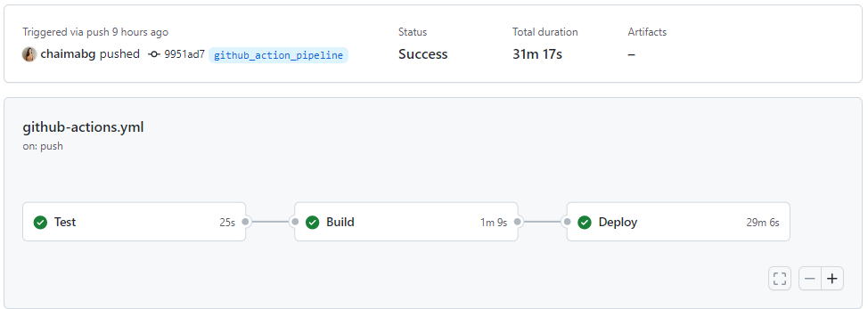
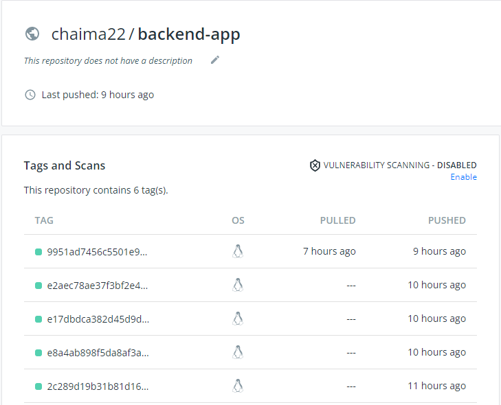

# DevOps
Creating a CI/CD pipeline for an application that helps to manage users.

## Technologies :


## CI/CD Pipeline:

- Implementing Backend application for user management with NodeJs/Express
- Applying unit & integration tests with Jest
- Building docker image and pushing it to DockerHub
- Deploying the application in AWS ECS

## GitHub Action Jobs :
```
  Test:
    runs-on: ubuntu-latest
    steps:
      - name: Check out repository code
        uses: actions/checkout@v3
      - uses : actions/setup-node@v3
        with:
          node-version:
      - run : npm install
      - run : npm test
  ```
```
  Build:
    runs-on : ubuntu-latest
    needs:
      - Test
    steps:
      - name: Checkout
        uses: actions/checkout@v3
      - name: Login to Docker Hub
        uses: docker/login-action@v1
        with:
          username: ${{ secrets.DOCKER_HUB_USERNAME }}
          password: ${{ secrets.DOCKER_HUB_ACCESS_TOKEN }}
      - name: Set up Docker Buildx
        uses: docker/setup-buildx-action@v1
      - name: Build and push
        uses: docker/build-push-action@v2
        with:
          context: .
          file: ./Dockerfile
          push: true
          tags: ${{ secrets.DOCKER_HUB_USERNAME }}/backend-app:${{ github.sha }}
 ```
```
  deploy:
    name: Deploy
    runs-on: ubuntu-latest
    needs:
      - Build

    steps:
      - name: Checkout
        uses: actions/checkout@v3

      - name: Configure AWS credentials
        uses: aws-actions/configure-aws-credentials@13d241b293754004c80624b5567555c4a39ffbe3
        with:
          aws-access-key-id: ${{ secrets.AWS_ACCESS_KEY_ID }}
          aws-secret-access-key: ${{ secrets.AWS_SECRET_ACCESS_KEY }}
          aws-region: ${{ env.AWS_REGION }}

      - name: Fill in the new image ID in the Amazon ECS task definition
        id: task-def
        uses: aws-actions/amazon-ecs-render-task-definition@97587c9d45a4930bf0e3da8dd2feb2a463cf4a3a
        with:
            task-definition: ${{ env.ECS_TASK_DEFINITION }}
            container-name: ${{ env.CONTAINER_NAME }}
            image: ${{ secrets.DOCKER_HUB_USERNAME }}/backend-app:${{ github.sha }}


      - name: Deploy Amazon ECS task definition
        uses: aws-actions/amazon-ecs-deploy-task-definition@de0132cf8cdedb79975c6d42b77eb7ea193cf28e
        with:
          task-definition: ${{ steps.task-def.outputs.task-definition }}
          service: ${{ env.ECS_SERVICE }}
          cluster: ${{ env.ECS_CLUSTER }}
          wait-for-service-stability: true
```

## Result





